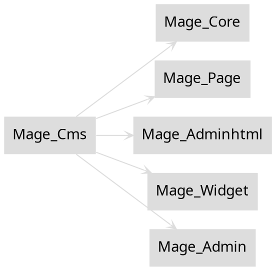

# Watson Safari

A tool which produces high-level documentation (e.g. Flowcharts) for common tasks, e.g. Adding products to basket, checking stock levels, etc.

This tool is intended to provide the answer to questions like 'What happens when you add a product to the basket?', 'What happens to stock levels during checkout?', etc

See also https://github.com/ProcessEight/Watson-Code-Coverage-Experiments for embryonic experiments in this regard.

* [Watson Safari](#watson-safari)
  * [Thoughts](#thoughts)
  * [Considerations](#considerations)
  * [Tools](#tools)
     * [PHP-Parser](#php-parser)
     * [Xdebug and Code Coverage](#xdebug-and-code-coverage)
     * [xdebugtoolkit](#xdebugtoolkit)
     * [Valgrind/callgrind](#valgrindcallgrind)
     * [GrindKit](#grindkit)
     * [PHP_CachegrindParser](#php_cachegrindparser)
     * [grind-pilot](#grind-pilot)
     * [New Relic, Blackfire.io](#new-relic-blackfireio)
     * [OpenTrace](#opentrace)
     * [Reflection](#reflection)
     * [PhpStorm: Tools &gt; Analyze Stack Trace...](#phpstorm-tools--analyze-stack-trace)
     * [PhpStorm: Tools &gt; Analyze Xdebug Profile Snapshot...](#phpstorm-tools--analyze-xdebug-profile-snapshot)
     * [DePHPend](#dephpend)
     * [mpmd](#mpmd)
     * [GraphvizFiddle](#graphvizfiddle)
     * [yUML](#yuml)
     * [Yireo ExtensionChecker](#yireo-extensionchecker)
     * [Rector](#rector)

## Thoughts

* Generate trace using Xdebug Profiler or similar
* Create a new `bin/magento` command
* Pass in a Xdebug Profiler tracefile
* Parse the trace, with the following aims:
    * Highlight extension points (public methods (for plugins), events)
    * Produce customisation reports:
        * Produce report of all third-party extensions (i.e. Extensions not present in a stock Magento install)
            * Where they are called
            * How the logic is invoked (i.e. `Event`, `plugin`, `preference`, etc)
            * What they are doing
        * All events
            * Those which were dispatched
                * Document the module which defines the `observer`
                * Document the event name, variables passed in
            * Those which were not
                * Document the event name, variables passed in
        * All defined plugins
        * All preferences where a Magento core interface is implemented by a non-Magento class
    * Produce high-level overview of execution flow (possibly in form of flowchart, or just plain text description)
    * Whenever a new class is called, or a class outside the current module is called, add a new element to the flow chart

## Objectives

- [x] Find a way to record every line of every PHP file that is executed
    - Figure out which tool would be best
        - Decision: Xdebug with Code and Branch Coverage
    - Figure out which tracefile format would be best for parsing
        - Decision: Use Xdebug's code coverage array format. This is different to the Xdebug tracer or profiler features.
- [x] Use the prepend/append scripts and 'cover' the execution of the simplest possible `bin/magento` 'Hello world' command        
- Parse the output of `xdebug_get_code_coverage()`
- Which flags to use? Experiment with flags passed to `xdebug_start_code_coverage()`
    - All three possible flags (`XDEBUG_CC_DEAD_CODE | XDEBUG_CC_UNUSED | XDEBUG_CC_BRANCH_CHECK`) must be used to generate all the information we need
- Build a tool which can create the dot files for a flowchart by parsing the output of a really simple PHP script
    - Using Xdebug's `magento/branch-coverage-to-dot.php` as a starting point
    - Then move onto parsing the simplest possible Magento 2 script, e.g. A `bin/magento` command

## Considerations

- Tool should be able to be run on any codebase, so the above can be generated
- All functions above should be programmable, so charts, documentation, etc can be generated automatically without human intervention
- Added a switch to toggle between generating DOT graphs and HTML table
    - For the HTML version, link each line number to the line number of the actual file, otherwise it'll be much harder to interpret what the table is showing

## Usage instructions

- Generate a code coverage array using the command:
```bash
$ php71 -dauto_prepend_file=/var/www/html/watson/watson-safari/xdebug_code_coverage_auto_prepend_file.php -dauto_append_file=/var/www/html/watson/watson-safari/xdebug_code_coverage_auto_append_file.php bin/magento examples:hello-world
```

- Pass that to the `bin/magento` parser command:
```bash
# Coming soon
```

## Tools

### Generating trace files

### Xdebug and Code Coverage
https://derickrethans.nl/path-branch-coverage.html

https://xdebug.org/docs/code_coverage

PHP extension for debugging, generating cachegrind profiler files and code coverage statistics and much more

#### Valgrind/callgrind
http://valgrind.org/docs/manual/cl-manual.html
Callgrind: a call-graph generating cache and branch prediction profiler

#### New Relic, Blackfire.io
How can they help with the Projects above?

#### OpenTrace
https://github.com/opentracing/opentracing-php

Platform-agnostic Application Performance Measurement (APM) tool to track requests or 'transactions' across the different langages, environments, etc that make up a complete request.

### Parsing trace files

#### xdebugtoolkit
https://github.com/alexeykupershtokh/xdebugtoolkit

A toolkit for splitting, aggregating, analyzing and visualizing xdebug cachegrind files.

#### GrindKit
https://github.com/c9s/GrindKit

A tool for reading cachegrind files in PHP.

#### PHP_CachegrindParser 
https://github.com/mayflower/PHP_CachegrindParser

A parser for cachegrind files, generating an xml format for CI usage and graphviz .dot files

#### grind-pilot
https://github.com/troelskn/grind-pilot

Command line browser for cachegrind files

#### PhpStorm: Tools > Analyze Stack Trace...
#### PhpStorm: Tools > Analyze Xdebug Profile Snapshot...
See https://www.jetbrains.com/help/phpstorm/analyzing-xdebug-profiling-data.html

- What do these tools do? How could they be useful to us?

#### DePHPend
https://dephpend.com/

A tool which analyses PHP source code to produce various outputs.

dePHPend analyses your app and attempts to find everything you depend on.

With this information you can:

- get a quick overview of how an application is structured
- start refactoring where it's needed the most
- track architecture violations (maybe your view shouldn't be telling the model what to do?)
- find out why your changes are breaking tests

#### mpmd
https://github.com/AOEpeople/mpmd

n98-magerun (for Magento 1) plugin which produces dependency graphs in the `DOT` language [directed] graph syntax. These can then be translated into graphs in various formats, e.g. SVG, PDF, etc.

#### GraphvizFiddle
https://stamm-wilbrandt.de/GraphvizFiddle/

A tool for visualising graphs written in the `DOT` language syntax

E.g: Try pasting the following:


This `DOT` code was generated using the command:

```bash
./n98-magerun.phar mpmd:dependencycheck:graph:module app/code/core/Mage/Cms/
```
#### yUML
https://yuml.me/

Tool which allows generating UML diagrams in-browser. Also exposes REST API for creating UML diagrams.

### Producing/formatting debugging data

#### Magento DevTools by Mage Specialist
https://github.com/magespecialist/m2-MSP_DevTools

https://github.com/magespecialist/mage-chrome-toolbar

Google Chrome extension and Magento 1/2 extension

- How does it gather debugging/profiling data from Magento 2?

#### PHP-Parser
https://github.com/nikic/PHP-Parser

A PHP source code parser, itself written in PHP, which can convert PHP source code to an AST and back again.

#### Reflection
https://secure.php.net/reflection

A part of the PHP core which allows introspection of PHP source code from within PHP

PHP 7 comes with a complete reflection API that adds the ability to reverse-engineer classes, interfaces, functions, methods and extensions. 

Additionally, the reflection API offers ways to retrieve doc comments for functions, classes and methods.

#### Yireo ExtensionChecker
https://github.com/yireo/Yireo_ExtensionChecker
A CLI tool which tokenises PHP to check the validity of code used in Magento extensions

#### Rector
https://github.com/rectorphp/rector

A CLI tool which can refactor/rewrite code by manipulating the AST
